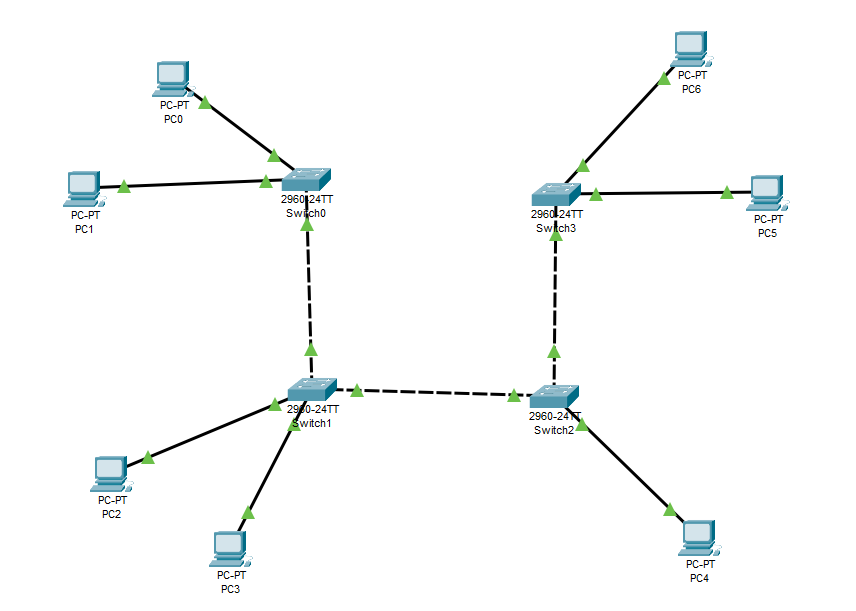
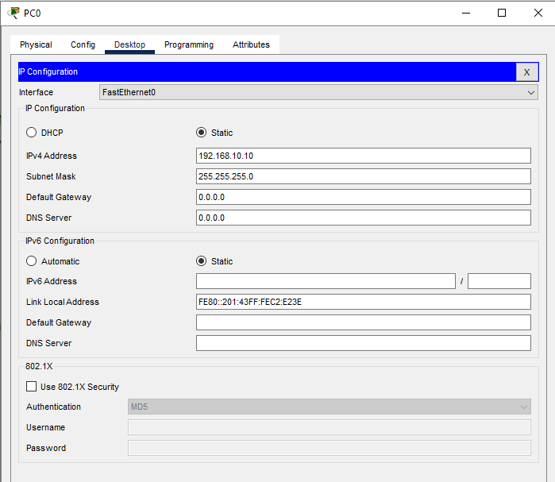
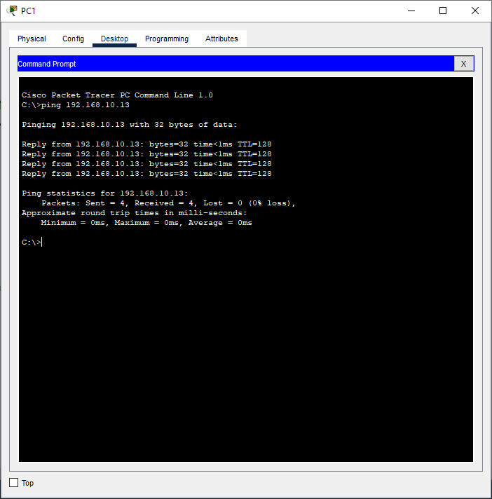
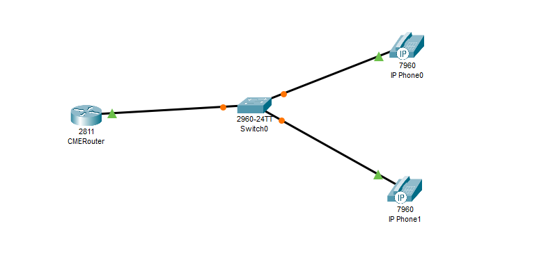
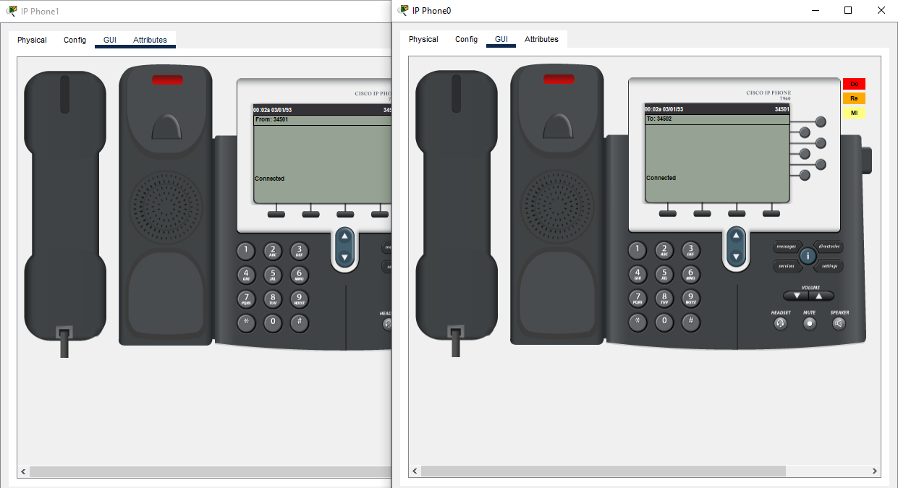

University: [ITMO University](https://itmo.ru/ru/)  
Faculty: [FICT](https://fict.itmo.ru)  
Course: [IP-telephony](https://itmo-ict-faculty.github.io/ip-telephony/)  
Year: 2024/2025  
Group: K34212  
Author: Deineko Roman Pavlovich  
Lab: Lab1  
Date of create: 28.04.2025  
Date of finished: 28.04.2024  


## Отчет по лабораторной работе №1
### ["Базовая настройка ip-телефонов в среде Сisco packet tracer"](https://itmo-ict-faculty.github.io/ip-telephony/education/labs2023_2024/lab1/lab1/)

#### 1. Цель  
Изучить рабочую среду Cisco Packet Tracer, ознакомить- ся с интерфейсами основных устройств, типами кабелей, научиться собирать топологию. Изучить построение сети IP-телефонии с помощью маршрутизатора, коммутатора и IP телефонов Cisco 7960 в среде Packet tracer

#### 2. Задачи Части 1

1. Изучить теоретическую и практическую части лабораторной работы.
2. Собрать схему соединения.
3. Научиться настраивать коммутаторы и компьютеры для полноценной работы сети.
4. Научиться применять основной список команд для конфигурирования устройств сети.
5. После выполнения необходимых настроек необходимо убедиться в том, что любой компьютер одной сети посредством пинга передает пакеты любому компьютеру другой сети.

#### 3. Задачи Части 2

1. Собрать схему соединения, указанную на рисунке
2. Изменить имя маршрутизатора на CMERouter.
3. Настроить интерфейс fa0/0 на маршрутизаторе Cisco 2811 (CMERouter).
4. Настроить DHCP сервера для передачи голоса и данных на маршрутизаторе - Cisco 2811.
5. Настроить услуги телефонии Cisco CallManager Express на маршрутизаторе 2811.
6. Настроить маршрутизацию сети.
7. Создать VLAN порты на коммутаторе для взаимодействия коммутатора с маршрутизатором и подключить IP телефоны.
8. Настроить IP-телефоны, присвоить им номера и соединить с коммутатором.
9. Проверить звонки между телефонами и проверить остальные сервисы (перевод звонков, конференц-связь, перехват звонка).

#### 4. Ход работы

#### 4.1. Часть 1

В первой части лабораторной работы была собрана схема соединения, состоящая из 7 персональных компьютеров и четырех коммутаторов.
<p align="center"></p>

Каждому компьютеру были выданы статические адреса из локальной сети 192.168.10.0/24
<p align="center"></p>

Далее было проведено тестирование связи с помощью пересылки icmp пакета между PC0 и PC3
<p align="center"></p>

#### 4.2. Часть 2

Была собрана схема соединения, состоящая из маршрутизатора, коммутатора и 2 IP-телефонов. Имя маршрутизатора изменено на CMERouter.
<p align="center"></p>

Настройки dhcp-пула:
```
ip dhcp pool voice
   network 192.168.0.0 255.255.255.0
   default-router 192.168.0.1
   option 150 ip 192.168.0.1
```

Настройки сервиса телефонии:
```
telephony-service
   max-ephones 2
   max-dn 2
   ip source-address 192.168.0.1 port 2000
   auto assign 1 to 2
```

На коммутаторе для всех трех интерфейсов была прописана команда "switchport voice vlan 1"

Телефонам были присвоены номера:
```
ephone-dn 1
   number 34501

ephone-dn 2
   number 34502
```

Проверка связности:
<p align="center"></p>

#### 5. Вывод
В ходе лабораторной работы были выполнены все поставленные задачи. Были собраны две схемы связи, в них были произведены настройки, обеспечивающие соединение между устройствами.
