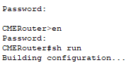

University: [ITMO University](https://itmo.ru/ru/)  
Faculty: [FICT](https://fict.itmo.ru)  
Course: [IP-telephony](https://itmo-ict-faculty.github.io/ip-telephony/)  
Year: 2024/2025  
Group: K34212  
Author: Deineko Roman Pavlovich  
Lab: Lab2  
Date of create: 28.04.2025  
Date of finished: 28.04.2024


## Отчет по лабораторной работе №2
### ["Конфигурация voip в среде Сisco packet tracer"](https://itmo-ict-faculty.github.io/ip-telephony/education/labs2023_2024/lab2/lab2/)

#### 1. Цель  
Иизучить построение сети IP-телефонии с помощью маршрутизатора Cisco 2811, коммутатора Cisco catalyst 3560 и IP телефонов Cisco 7960.

#### 2. Задачи Части 1

1. В конфигурационном режиме измените название маршру- тизатора на CMERouter.
2. Отключите синтаксис ввода слов от DNS серверов.
3. Задайте пароли для защиты маршрутизатора как в удаленном режиме, так и в режиме консоли.
4. Настройте интерфейс fa0/0 на маршрутизаторе Cisco 2811 (CMERouter).
5. Настроить DHCP сервера для передачи голоса и данных на маршрутизаторе Cisco 2811.
6. Настроить услуги телефонии Cisco CallManager Express на маршрутизаторе 2811.
7. Создать VLAN порты на коммутаторе Cisco Catalyst 3560 для взаимодействия коммутатора с маршрутизатором и подключить IP телефоны.
8. Настроить IP-телефоны и соединить с коммутатором Cisco Catalyst 3560.
9. Проверить звонки между телефонами и проверить остальные сервисы (перевод звонков, конференц-связь, перехват звонка).

#### 3. Задачи Части 2

1. Создать VLAN порты на коммутаторе для взаимо- действия коммутатора с маршрутизатором и подключить IP телефоны.
2. Задайте маршрут по умолчанию командой ip default-gateway.
3. Настройте порт как канал типа trunk.
4. Настроить DHCP сервера для передачи голоса и данных на маршрутизаторе Cisco 2811.
5. Настроить услуги телефонии Cisco CallManager Express на маршрутизаторе.
6. Настроить IP-телефоны и соединить с коммутатором.
7. Подключить конечные узлы устройств.
8. Проверить звонки между телефонами и проверить остальные сервисы (перевод звонков, конференц-связь, перехват звонка).

#### 4. Ход работы  

#### 4.1. Часть 1

Создана схема из 3-ёх IP-телефонов, 1-го маршрутизатора и 1-го L3 коммутатора
<p align="center"></p>

Заданы пароли для защиты маршрутизатора как в удаленном режиме, так и в режиме консоли с помощью команд enable secret и password
<p align="center"></p>

Настройки dhcp-пула:
```
ip dhcp pool voice
   network 192.168.0.0 255.255.255.0
   default-router 192.168.0.1
   option 150 ip 192.168.0.1
```

Настройки сервиса телефонии:
```
telephony-service
   max-ephones 3
   max-dn 3
   ip source-address 192.168.0.1 port 2000
   auto assign 1 to 3
```

На коммутаторе для всех интерфейсов была прописана команда "switchport voice vlan 1"

Телефонам были присвоены номера:
```
ephone-dn 1
   number 1001

ephone-dn 2
   number 1002

ephone-dn 3
   number 1003
```

Проверка связности:
<p align="center"></p>

#### 4.2. Часть 2

Схема сети:
<p align="center"></p>

Настройки vlan и интерфейсов 
На роутере:
```
interface FastEthernet0/0.10
 encapsulation dot1Q 10
 ip address 192.168.10.1 255.255.255.0

interface FastEthernet0/0.20
 encapsulation dot1Q 20
 ip address 192.168.20.1 255.255.255.0
```

На коммутаторе:
```
interface FastEthernet0/1
 switchport trunk encapsulation dot1q
 switchport mode trunk
 switchport voice vlan 1

interface FastEthernet0/2
 switchport access vlan 20
 switchport voice vlan 10

interface FastEthernet0/3
 switchport access vlan 20
 switchport voice vlan 10

interface FastEthernet0/4
 switchport access vlan 20
 switchport voice vlan 10
```

Настройки dhcp-пулов:
```
ip dhcp pool vlan10
 network 192.168.10.0 255.255.255.0
 default-router 192.168.10.1
 option 150 ip 192.168.10.1

ip dhcp pool vlan20
 network 192.168.20.0 255.255.255.0
 default-router 192.168.20.1
 option 150 ip 192.168.20.1
```

Настройки сервиса телефонии:
```
telephony-service
 max-ephones 3
 max-dn 3
 ip source-address 192.168.10.1 port 2000
 auto assign 1 to 3
```

Присвоение номеров телефонам:
```
ephone-dn 1
 number 1001

ephone-dn 2
 number 1002

ephone-dn 3
 number 1003
```

Проверки связности:
<p align="center"></p>

<p align="center"></p>

#### Вывод

Изучено построение сети IP-телефонии с помощью маршрутизатора Cisco 2811, коммутатора Cisco catalyst 3560 и IP телефонов Cisco 7960
