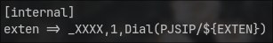

University: [ITMO University](https://itmo.ru/ru/)  
Faculty: [FICT](https://fict.itmo.ru)  
Course: [IP-telephony](https://itmo-ict-faculty.github.io/ip-telephony/)  
Year: 2024/2025  
Group: K34212  
Author: Deineko Roman Pavlovich  
Lab: Lab3  
Date of create: 28.04.2025  
Date of finished: 28.04.2024  

## Отчет по лабораторной работе №3
### ["Использование Asterisk в качестве SIP proxy"](https://itmo-ict-faculty.github.io/ip-telephony/education/labs2023_2024/lab2/lab2/)

#### 1. Цель  

Изучить программный комплекс Asterisk. Настройка Asterisk для локальных звонков.

#### 2. Задачи

1. Установить систему server.
2. Установить Asterisk.
3. Установить soft телефон на рабочую станцию.
4. Настроить SIP каналы.
5. Подключиться к SIP каналам soft телефона.
6. Сделать тестовый звонок на номер 1000

#### 3. Ход работы  

Устанавливаем Asterisk

Устанавливаем GNOME Calls - softphone (приложение для VoIP-звонков)

Настраиваем Asterisk - файл /etc/asterisk/pjsip.conf

Файл /etc/asterisk/extensions.conf
В контексте internal при звонке на любой четырёхзначный номер (_XXXX) звоним по протоколу PJSIP (${EXTEN} превращается в указанный номер)

Включаем Asterisk и заходим в CLI для проверки конфигурации. Флаг -u asterisk говорит sudo выполнять команду не от пользователя root, а от пользователя asterisk. Флаг -r - подключиться к уже запущенному серверу, -v - выводить подробную информацию

Проверяем существование заданных endpoint-ов. Так как подключение к ним ещё не осуществлено, они находятся в состоянии Unavailable

Добавляем две учётные записи в GNOME Calls

После входа в сеть в GNOME Calls статус поменялся на Not in use, а также добавилась информация о том, откуда было произведено соединение

Совершаем звонок

Состояние во время звонка: вызывающий в статусе Ring, вызываемый в Down

#### 4. Вывод  

В результате выполнения лабораторной работы удалось изучить программный комплекс Asterisk, настроить Asterisk для локальных звонков.
